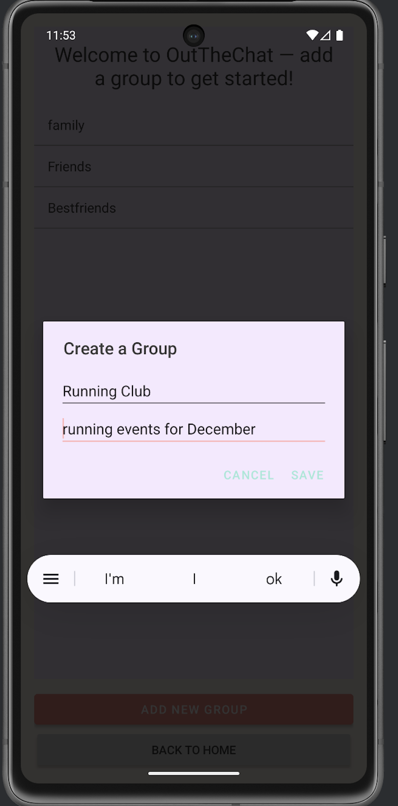
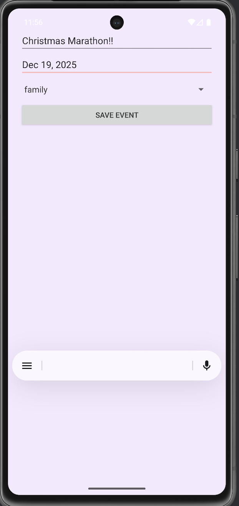

# android-studio-projects
# Android Studio Projects

## OutTheChat – Android App

OutTheChat is a chat-style Android application built using Java in Android Studio. The app allows users to create groups and add events within those groups, demonstrating user interaction and basic data handling.

### Features
- Create and manage groups
- Add events to specific groups
- Dialog-based user input
- Clean UI with multiple screens and navigation

### Tools Used
- Java
- Android Studio

### Screenshots

### Project Files
Due to the large number of Android project files, the full source code is included as a ZIP file:
- OutTheChat.zip
